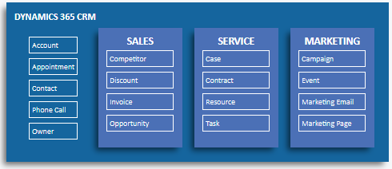
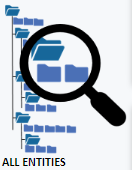
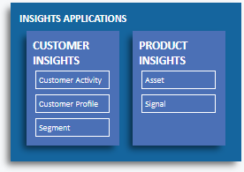
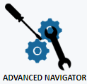
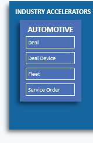
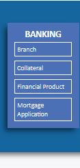
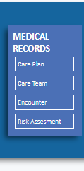
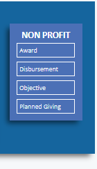

# We welcome your feedback

Do you use the Common Data Model SDK?  If you do, please can you tell us which version(s) you use (C#/.NET, Java, Python, or TypeScript) by taking this [**short survey**](https://forms.office.com/r/hainr3a7rR).

# Common Data Model (CDM) Schema

The Common Data Model is a declarative specification, and definition of standard entities that represent commonly used concepts and activities across business and productivity applications, and is being extended to observational and analytical data as well. CDM provides well-defined, modular, and extensible business entities such as Account, Business Unit, Case, Contact, Lead, Opportunity, and Product, as well as interactions with vendors, workers, and customers, such as activities and service level agreements. Anyone can build on and extend CDM definitions to capture additional business-specific ideas.

<pre>
  

</pre>

# Introduction

The Common Data Model standard defines a common language for business entities covering, over time, the full range of business processes across sales, services, marketing, operations, finance, talent, and commerce and for the Customer, People, and Product entities at the core of a company's business processes. The goal of CDM is to enable data and application interoperability spanning multiple channels, service implementations, and vendors. CDM provides self-describing data (structurally and semantically), enabling applications to easily read and understand the data.

The CDM is undergoing a specification effort driven by Microsoft and the documents published are continuously being iterated upon.

This project has adopted the [Microsoft Open Source Code of Conduct](https://opensource.microsoft.com/codeofconduct/).
For more information see the [Code of Conduct FAQ](https://opensource.microsoft.com/codeofconduct/faq/) or
contact [opencode@microsoft.com](mailto:opencode@microsoft.com) with any additional questions or comments.

# Repository Layout

There are two ways to consume the information in this repository:

1. [Entity Reference Index](schemaDocuments#directory-of-cdm-entities)
2. [Visual Entity Navigator](https://microsoft.github.io/CDM/) for interactively exploring entities, entity extensions/inheritance, attributes, and relationships

# Versioning

Maintaining forward and backward compatibility is a key goal of the CDM. Therefore, the CDM uses only additive versioning, which means any revision of the CDM following a "1.0" release will not:

* Introduce new mandatory attributes on previously published entities, or change an optional attribute to be mandatory
* Rename previously published attributes or entities
* Remove previously published attributes

# Legal Notices

Microsoft and any contributors grant you a license to the Microsoft documentation and other content
in this repository under the [Creative Commons Attribution 4.0 International Public License](https://creativecommons.org/licenses/by/4.0/legalcode),
see the [LICENSE](LICENSE) file, and grant you a license to any code in the repository under the [MIT License](https://opensource.org/licenses/MIT), see the
[LICENSE-CODE](LICENSE-CODE) file.

Microsoft, Windows, Microsoft Azure and/or other Microsoft products and services referenced in the documentation
may be either trademarks or registered trademarks of Microsoft in the United States and/or other countries.
The licenses for this project do not grant you rights to use any Microsoft names, logos, or trademarks.
Microsoft's general trademark guidelines can be found at http://go.microsoft.com/fwlink/?LinkID=254653.

Privacy information can be found at https://privacy.microsoft.com/en-us/

Microsoft and any contributors reserve all others rights, whether under their respective copyrights, patents,
or trademarks, whether by implication, estoppel or otherwise.
